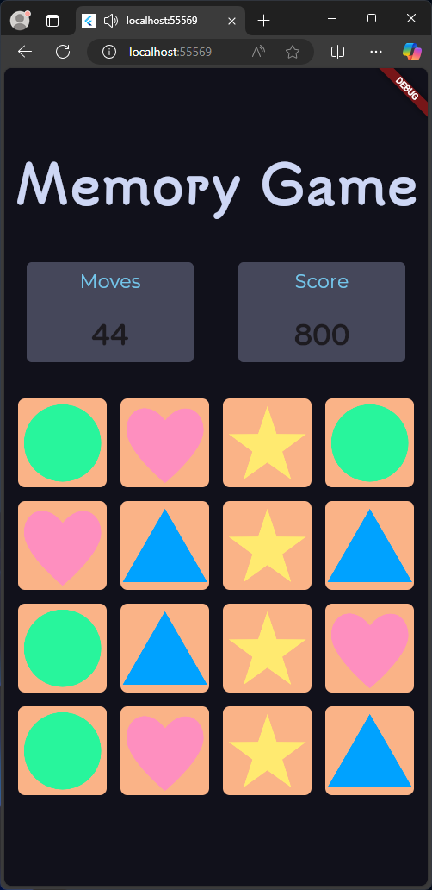

# memory_game

## Šta je memory game?

**Memory Game** je igra koja izaziva igrače da pronađu parove identičnih karata. Evo ključnih tačaka o igri:

1. **Cilj igre**: Podudariti parove karata sa istim slikama ili simbolima.
2. **Način igre**: Karte su obično postavljene licem nadole, a igrači naizmenično otkrivaju dve karte u pokušaju da pronađu parove.
3. **Zakonitost igre**: Ako se karte podudaraju, ostaju otkrivene; ako ne, vraćaju se na poziciju licem nadole.
4. **Vještine**: Igra pomaže u razvoju memorije i koncentracije, jer igrači moraju da pamte pozicije karata.
5. **Varijacije**: Može se igrati sa različitim brojem karata, temama i težinskim nivoima, što čini igru prikladnom za sve uzraste.

Igra se može igrati na fizičkim kartama ili kao digitalna verzija na računarima i mobilnim uređajima.

  

